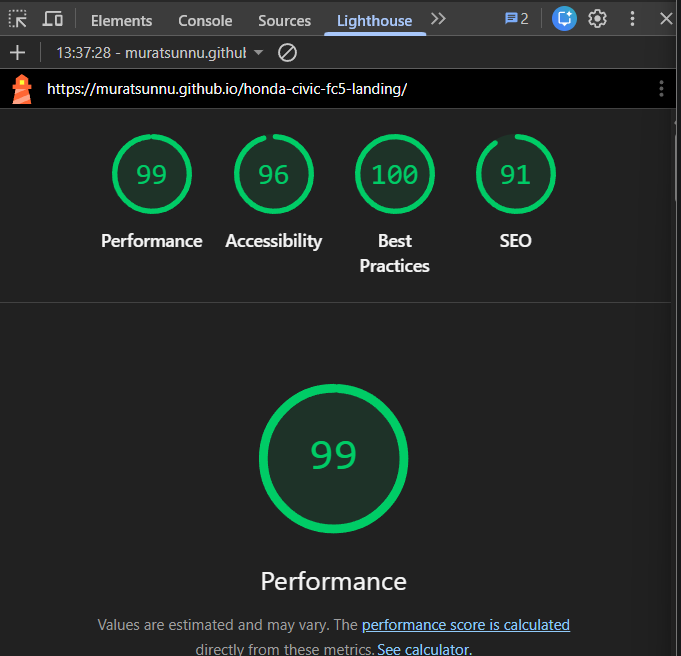

# Honda Civic FC5 — Ürün Tanıtım Landing Page

Honda Civic FC5 için tek sayfalık, mobil öncelikli ve erişilebilir bir ürün tanıtım sayfası. Vite + React + TypeScript ile yazıldı; stiller saf SCSS (BEM) ile, harici bir UI kütüphanesi kullanılmadan oluşturuldu.

🔗 **Canlı demo:** https://muratsunnu.github.io/honda-civic-fc5-landing/



## İçerik

Sayfa beş bölümden oluşur:

- **Hero** — başlık, kısa tanıtım ve eylem butonları
- **Özellikler** — motor, yakıt, vites ve bagaj öne çıkanları
- **Donanım Paketleri** — Elegance, Eco Elegance, Executive, Eco Executive
- **SSS** — açılır/kapanır soru-cevap (Accordion)
- **İletişim** — doğrulamalı form ve başarı modalı (yalancı submit)

Tema değiştirici (light/dark) ile tüm sayfa anlık tema desteği sunar.

## Teknolojiler

- **Vite** + **React 19** + **TypeScript**
- **SCSS** (BEM isimlendirme, CSS custom property ile tema)
- **ESLint** + **Prettier**
- **GitHub Actions** (CI + GitHub Pages deploy)
- **sharp** (görsel optimizasyonu)

## Kurulum

```bash
npm install        # bağımlılıkları yükle
npm run dev        # geliştirme sunucusu (http://localhost:5173)
```

## Komutlar

| Komut | Açıklama |
| --- | --- |
| `npm run dev` | Geliştirme sunucusunu başlatır |
| `npm run build` | Production build üretir (`dist/`) |
| `npm run preview` | Build çıktısını yerelde önizler |
| `npm run lint` | ESLint kontrolü |
| `npm run format` | Prettier ile biçimlendirme |
| `npm run optimize:images` | Kaynak görselleri WebP'ye optimize eder |

## Proje Yapısı

```
src/
├── components/      # Yeniden kullanılabilir UI bileşenleri
│   ├── Button/
│   ├── Input/
│   ├── Card/
│   ├── Accordion/
│   ├── Modal/
│   └── ThemeToggle/
├── sections/        # Sayfa bölümleri
│   ├── Hero/
│   ├── Features/
│   ├── Pricing/
│   ├── FAQ/
│   └── Contact/
├── hooks/           # useTheme
├── styles/          # _variables, _reset, _mixins, global
└── assets/          # Optimize edilmiş görseller
```

Her bileşen ve bölüm kendi klasöründe `.tsx` + `.scss` ikilisi olarak tutulur.

## Mimari Notlar

- **Bileşen mimarisi:** Beş çekirdek bileşen (Button, Input, Card, Accordion, Modal) props ile yapılandırılır ve sayfa bölümleri bu bileşenleri besteleyerek (composition) kurulur. Örneğin Contact bölümü Input + Button + Modal bileşenlerini birlikte kullanır.
- **Stil:** Tek bir global CSS sıfırlama, CSS custom property tabanlı tema ve BEM isimlendirme. Renkler `:root` ve `[data-theme="dark"]` altında tanımlı; tema değişimi yalnızca `<html>` üzerindeki `data-theme` özniteliğini değiştirir.
- **Responsive:** Mobil öncelikli yaklaşım; `_mixins.scss` içindeki `tablet` (≥641px) ve `desktop` (≥1025px) mixin'leri ile üç kırılım yönetilir.
- **Erişilebilirlik:** Semantik HTML, `label`/`id` eşleşmesi, `aria-*` öznitelikleri, klavye ile gezinme ve görünür odak halkaları.
- **Performans:** Hero görseli `srcset` ile iki boyutta WebP olarak sunulur; `aspect-ratio` ile yerleşim kayması (CLS) engellenir.

Karar gerekçeleri için: [docs/](docs/) altındaki ADR dosyaları.

## Dallanma Stratejisi

- `main` — kararlı sürüm (GitHub Pages buradan deploy edilir)
- `dev` — geliştirme ana dalı
- `feat/*`, `fix/*`, `chore/*`, `ci/*`, `docs/*` — özellik/düzeltme dalları

Commit mesajları [Conventional Commits](https://www.conventionalcommits.org/) biçimindedir.
